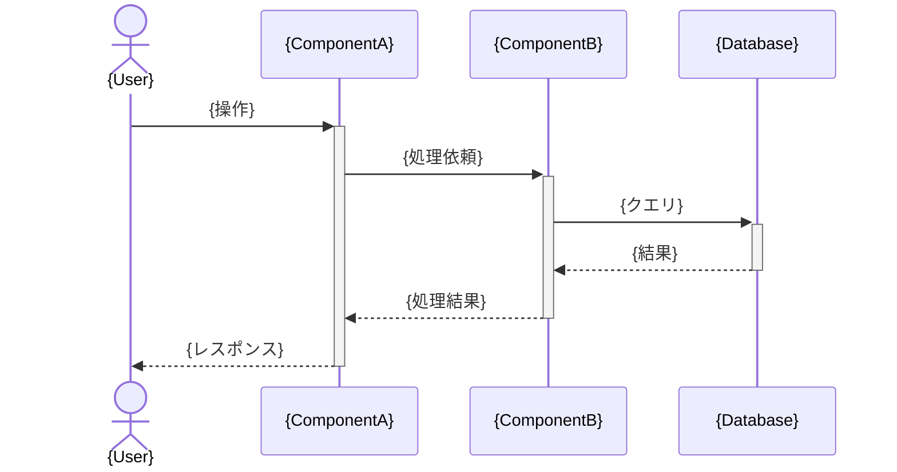

# 6. データフロー

**主要ユースケースのシーケンス図:**

## {ユースケース名}

```mermaid
sequenceDiagram
    actor {User}
    participant {ComponentA}
    participant {ComponentB}
    participant {Database}

    {User}->>+{ComponentA}: {操作}
    {ComponentA}->>+{ComponentB}: {処理依頼}
    {ComponentB}->>+{Database}: {クエリ}
    {Database}-->>-{ComponentB}: {結果}
    {ComponentB}-->>-{ComponentA}: {処理結果}
    {ComponentA}-->>-{User}: {レスポンス}
```

<!-- ガイドライン: 主要なユースケース（正常系 + 主要な異常系）をシーケンス図で図示。各メッセージには具体的な処理内容を記載 -->
