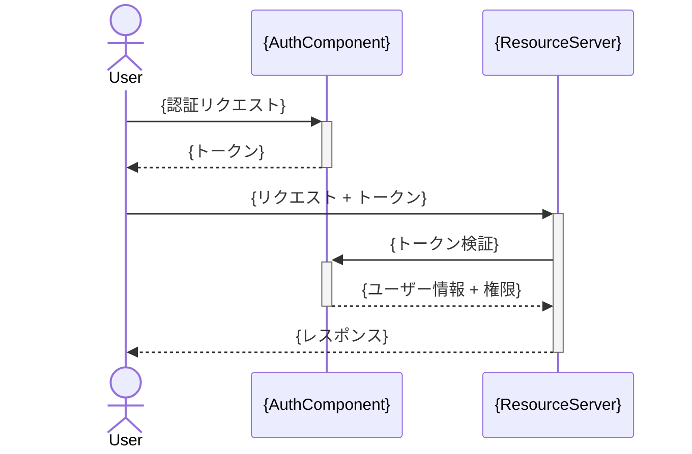

# 9. セキュリティ設計

**認証/認可フロー:**

**入力バリデーション規則:**

| 入力 | バリデーション | サニタイズ |
|------|-------------|----------|
| {フィールド名} | {ルール（型、長さ、形式）} | {サニタイズ方法} |

**データ保護方針:**
- **保存時暗号化:** {対象データと暗号化方式}
- **通信時暗号化:** {TLS バージョン等}
- **機密データ:** {マスキング、アクセス制御方針}
- **ログ:** {ログに含めてはいけないデータ}

<!-- ガイドライン: OWASP Top 10 を考慮。入力は全てバリデーション。機密データはログに出力しない -->
