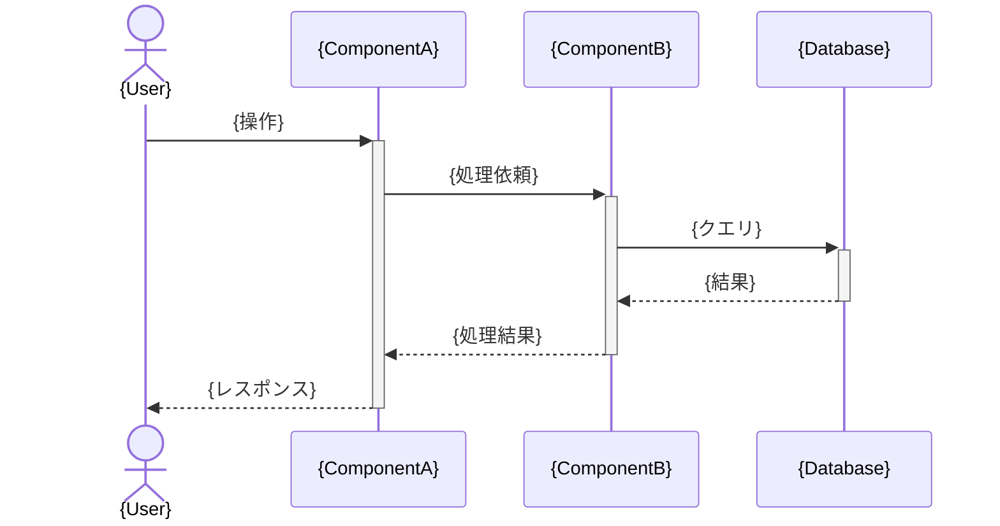
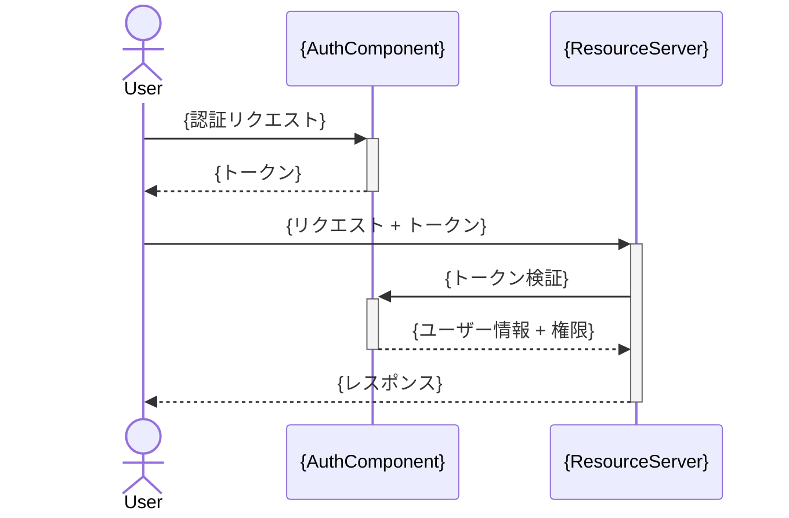

# 詳細設計書テンプレート

このテンプレートの `{プレースホルダ}` を埋めて詳細設計書を作成する。全12セクションが必須。該当しないセクションは「該当なし」と理由を記載すること。

---

# {プロジェクト名} 詳細設計書

## 1. 概要

**目的:** {このシステム/機能が解決する問題と達成する目標}

**スコープ:** {設計対象の範囲。含むものと含まないものを明記}

**前提条件:**
- {前提条件 1}
- {前提条件 2}

**用語定義:**

| 用語 | 定義 |
|------|------|
| {用語 1} | {定義 1} |
| {用語 2} | {定義 2} |

<!-- ガイドライン: 目的は「なぜ作るか」、スコープは「何を作る/作らないか」を明確に。用語定義は仕様書で使われる全ての専門用語を網羅する -->

## 2. システムアーキテクチャ

**技術スタック:**

| カテゴリ | 技術 | 選定理由 |
|---------|------|---------|
| {言語} | {技術名} | {理由} |
| {フレームワーク} | {技術名} | {理由} |
| {データベース} | {技術名} | {理由} |
| {インフラ} | {技術名} | {理由} |

**全体構成図:**

```mermaid
graph TB
    subgraph "{レイヤー名 1}"
        {コンポーネント 1}
        {コンポーネント 2}
    end
    subgraph "{レイヤー名 2}"
        {コンポーネント 3}
        {コンポーネント 4}
    end
    {接続関係}
```

**レイヤー構成:**
- **{レイヤー 1}:** {責務の説明}
- **{レイヤー 2}:** {責務の説明}
- **{レイヤー 3}:** {責務の説明}

<!-- ガイドライン: 技術スタックは現在のプロジェクトに合わせる。全体構成図は主要コンポーネントとその関係を Mermaid で図示。レイヤー構成は依存方向を明記 -->

## 3. API 設計

**エンドポイント一覧:**

| メソッド | パス | 説明 | 認証 |
|---------|------|------|------|
| {GET/POST/PUT/DELETE} | {/api/v1/resource} | {説明} | {要/不要} |

**認証方式:** {JWT / OAuth2 / API Key 等の説明}

**リクエスト/レスポンス定義:**

### {エンドポイント名}

**リクエスト:**
```json
{
  "{field}": "{type} — {説明}"
}
```

**レスポンス（成功）:**
```json
{
  "{field}": "{type} — {説明}"
}
```

**エラーコード一覧:**

| コード | HTTP ステータス | 説明 | 対応方法 |
|--------|---------------|------|---------|
| {ERR_001} | {400} | {説明} | {クライアント側の対応} |

<!-- ガイドライン: 全エンドポイントを網羅。リクエスト/レスポンスは JSON Schema レベルの詳細さ。エラーコードは体系的に番号付け -->

## 4. DB スキーマ設計

**ER 図:**

```mermaid
erDiagram
    {ENTITY_A} ||--o{ {ENTITY_B} : "{関係}"
    {ENTITY_A} {
        {type} {column_name} PK "{説明}"
        {type} {column_name} "{説明}"
    }
    {ENTITY_B} {
        {type} {column_name} PK "{説明}"
        {type} {column_name} FK "{説明}"
    }
```

**テーブル定義:**

### {テーブル名}

| カラム | 型 | NULL | デフォルト | 説明 |
|--------|-----|------|----------|------|
| {id} | {UUID} | NO | {gen_random_uuid()} | {主キー} |
| {name} | {VARCHAR(255)} | NO | | {説明} |
| {created_at} | {TIMESTAMP} | NO | {NOW()} | {作成日時} |

**インデックス:**

| テーブル | インデックス名 | カラム | 種別 | 用途 |
|---------|--------------|--------|------|------|
| {テーブル名} | {idx_name} | {columns} | {UNIQUE/BTREE/GIN} | {用途} |

**マイグレーション方針:** {新規作成 / 既存テーブルの変更手順 / ダウンタイム有無}

<!-- ガイドライン: ER 図は全テーブルの関係を Mermaid で表現。テーブル定義は全カラムを網羅。インデックスはクエリパターンに基づいて設計 -->

## 5. コンポーネント設計

**コンポーネント一覧:**

| コンポーネント | 責務 | 依存先 |
|-------------|------|--------|
| {コンポーネント名} | {単一責務の説明} | {依存するコンポーネント} |

**インターフェース定義:**

```
{コンポーネント名}:
  - {メソッド名}({引数}): {戻り値} — {説明}
```

**依存関係図:**

```mermaid
graph LR
    {ComponentA} --> {ComponentB}
    {ComponentA} --> {ComponentC}
    {ComponentB} --> {ComponentD}
```

<!-- ガイドライン: 各コンポーネントは単一責務。インターフェースは公開メソッドのみ。循環依存を避ける -->

## 6. データフロー

**主要ユースケースのシーケンス図:**

### {ユースケース名}



<!-- ガイドライン: 主要なユースケース（正常系 + 主要な異常系）をシーケンス図で図示。各メッセージには具体的な処理内容を記載 -->

## 7. ファイル構成

**ディレクトリツリー:**

```
{project-root}/
├── {dir1}/
│   ├── {file1}        # {説明}
│   └── {file2}        # {説明}
├── {dir2}/
│   ├── {subdir}/
│   │   └── {file3}    # {説明}
│   └── {file4}        # {説明}
└── {config-file}       # {説明}
```

**命名規則:**
- ファイル: {規則の説明（例: kebab-case）}
- クラス/コンポーネント: {規則の説明（例: PascalCase）}
- 関数/変数: {規則の説明（例: camelCase）}
- DB テーブル: {規則の説明（例: snake_case, 複数形）}

<!-- ガイドライン: 既存プロジェクトの構造に合わせる。新規作成ファイルのみでなく、変更するファイルも含める -->

## 8. エラーハンドリング

**エラー分類:**

| カテゴリ | 例 | HTTP ステータス | リトライ | ログレベル |
|---------|-----|---------------|---------|----------|
| バリデーションエラー | {例} | 400 | 不要 | WARN |
| 認証エラー | {例} | 401 | 不要 | WARN |
| 権限エラー | {例} | 403 | 不要 | WARN |
| リソース未存在 | {例} | 404 | 不要 | INFO |
| ビジネスロジックエラー | {例} | 409/422 | 不要 | WARN |
| 外部サービスエラー | {例} | 502/503 | 要 | ERROR |
| 内部エラー | {例} | 500 | 要 | ERROR |

**リトライ戦略:**
- {対象: 外部 API 呼び出し等}
- {リトライ回数: 最大 N 回}
- {バックオフ: 指数バックオフ、初期 {N}ms}
- {サーキットブレーカー: {条件}}

**フォールバック方針:**
- {機能 A}: {フォールバック時の振る舞い}
- {機能 B}: {フォールバック時の振る舞い}

<!-- ガイドライン: エラーはユーザー向けメッセージと開発者向けメッセージを分離。リトライは冪等な操作にのみ適用 -->

## 9. セキュリティ設計

**認証/認可フロー:**



**入力バリデーション規則:**

| 入力 | バリデーション | サニタイズ |
|------|-------------|----------|
| {フィールド名} | {ルール（型、長さ、形式）} | {サニタイズ方法} |

**データ保護方針:**
- **保存時暗号化:** {対象データと暗号化方式}
- **通信時暗号化:** {TLS バージョン等}
- **機密データ:** {マスキング、アクセス制御方針}
- **ログ:** {ログに含めてはいけないデータ}

<!-- ガイドライン: OWASP Top 10 を考慮。入力は全てバリデーション。機密データはログに出力しない -->

## 10. テスト戦略

**テスト種別:**

| 種別 | 対象 | ツール | カバレッジ目標 |
|------|------|--------|-------------|
| ユニットテスト | {ビジネスロジック、ユーティリティ} | {テストフレームワーク} | {目標%} |
| 統合テスト | {API エンドポイント、DB 操作} | {テストフレームワーク} | {目標%} |
| E2E テスト | {主要ユーザーフロー} | {テストフレームワーク} | {主要シナリオ} |

**テストデータ方針:**
- {テストデータの準備方法（Factory、Fixture、Seeder）}
- {テスト間のデータ分離方法}
- {外部サービスのモック方針}

**テスト実行:**
- {CI/CD でのテスト実行タイミング}
- {テスト環境の構成}

<!-- ガイドライン: テストは仕様のユースケースに対応させる。モックは外部境界のみ。統合テストを重視 -->

## 11. 非機能要件

**パフォーマンス目標:**

| メトリクス | 目標値 | 測定方法 |
|----------|--------|---------|
| レスポンスタイム (p95) | {目標} | {方法} |
| スループット | {目標 rps} | {方法} |
| 同時接続数 | {目標} | {方法} |

**スケーラビリティ方針:**
- **水平スケーリング:** {方針}
- **データベース:** {シャーディング、リードレプリカ等}
- **キャッシュ:** {キャッシュ戦略、TTL}

**監視項目:**

| 項目 | 閾値 | アラート先 |
|------|------|----------|
| {CPU 使用率} | {閾値} | {通知先} |
| {エラーレート} | {閾値} | {通知先} |
| {レスポンスタイム} | {閾値} | {通知先} |

<!-- ガイドライン: パフォーマンス目標は測定可能な数値で。監視項目はアラートの閾値とエスカレーション先を明記 -->

## 12. 仕様トレーサビリティ

**仕様要件 → 設計セクション対応表:**

| 要件 ID | 要件概要 | 設計セクション | 設計要素 |
|---------|---------|--------------|---------|
| {REQ-001} | {要件の概要} | {セクション番号. セクション名} | {具体的な設計要素} |
| {REQ-002} | {要件の概要} | {セクション番号. セクション名} | {具体的な設計要素} |

**カバレッジ:** {全要件数} 件中 {カバー済み} 件（{割合}%）

<!-- ガイドライン: 仕様書の全要件が設計のどこで対応されているかを追跡可能にする。カバレッジ 100% を目指す -->
